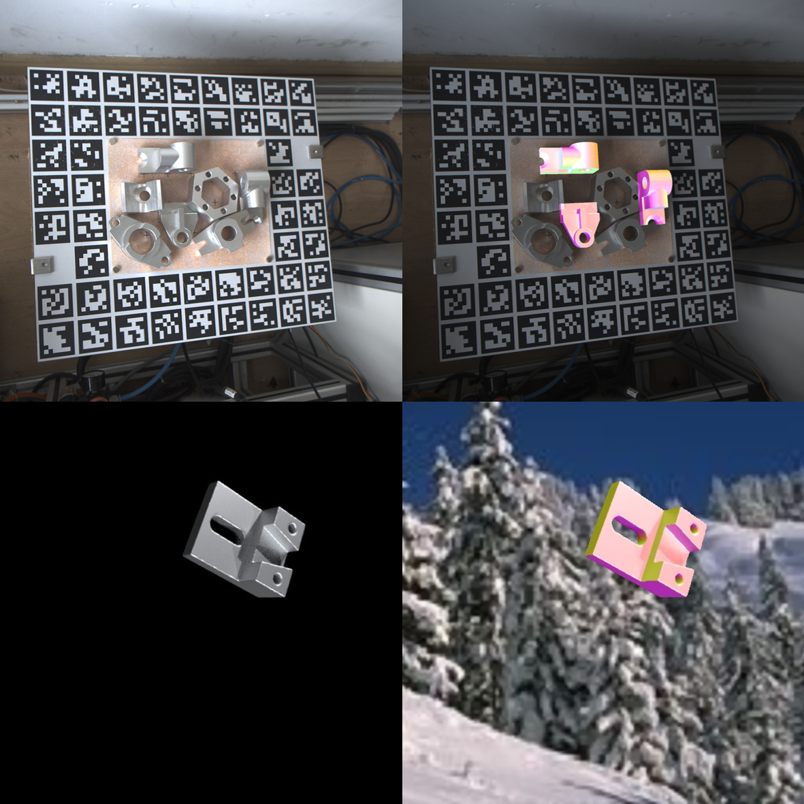

## RTL_Toolbox

RTL is a new public dataset of reflective texture-less metal parts. The dataset contains 38392 RGB images and the same number of masks, including 275k(25k true images + 250K Synthetic images) training images and 13312 testing images captured in 32 different scenes. This repository provides some python scripts that may be used when working with RTL dataset.  You can see more details at: [http://www.zju-rtl.cn/RTL/](http://www.zju-rtl.cn/RTL/).

## Requirements

```shell
pip install -r requirements.txt
```


## Scripts

dataset_rtl.py + data_utils.py: 

-  import images、ground-truth（yaml file）、bounding-box(yaml file)
- Can realize the function of dataset（Return a training or test data）

eval_rtl.py :

- Read the diameter (npy file) and calculate ADDS based on the threshold of 10% of the diameter
- Calculate the average rotation and translation errors
- Calculate projection_2d error

convex_hull_3d  + getDiameter.py :

- convex_hull_3d  : Read ply file to generate minimum 3D convex hull
- getDiameter.py ：According to the vertex set of the smallest 3D convex hull, the diameter of the object is calculated, that is, the distance between the two farthest points on the surface of the object

overlyRender : Render the ground-truth of the RTL render dataset and overly it on the original image to obtain the image as shown below.

overlayTrue：Render the ground-truth of the RTL true dataset and overly it on the original image to obtain the image as shown below.

overlayYours: Provide images and ground-truth and CADmodels of yours，you can get the image overlaied as shown below




read_stl.py : Read CAD models in "stl" format

overlayUtils.py : The script is depended on by overlyRender,  overlayTrue,  overlayYours.

randomBackground.py: Randomly replace the background (SUN dataset is used)

baseline_methods

- PSGMN: baseline method PSGMN
- SurfEmb: baseline method SurfEmb

render_data : Script to generate rendering dataset.

to_BOP:  It is used to convert RTL data to BOP format data and download it together with the picture

## References

[1] psgmn

[2] [psgmn](https://github.com/Ray0089/PSGMN)

[3] surfemb

[4] [surfemb](https://github.com/rasmushaugaard/surfemb)

[5] [convex_hull_3d  ](https://github.com/swapnil96/Convex-hull)

[6] [pvnet-rendering](https://github.com/zju3dv/pvnet-rendering)

